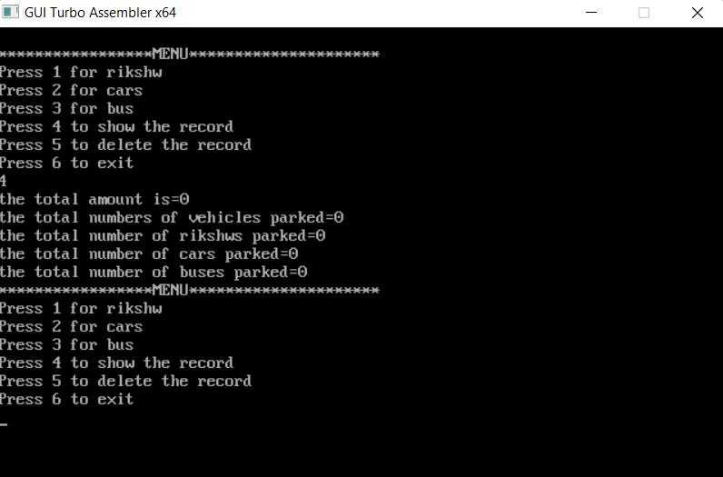

# assembly_project

The Digital Parking Management System is an innovative assembly project designed to streamline and optimize parking lot operations. This system leverages technology to efficiently manage parking spaces, track occupancy, and maintain a record of the types of vehicles parked within the premises. By utilizing sensors, databases, and user interfaces, this assembly project aims to provide a comprehensive solution for both users and parking lot administrators.

Key Features:
<ul>
  <li>simulate parking slot occupancy.</li>
  
  <li>providing accurate occupancy statistics.</li>
  
  <li>user input to categorize vehicles based on type (car, bus, rickshaw)</li>
  
</ul>

